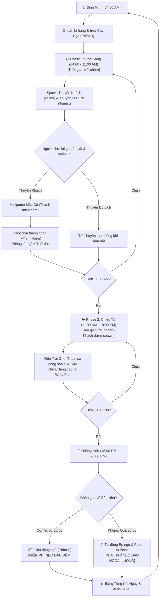

# Tài Liệu Thiết Kế Tính Năng & Core Gameplay MVP — Chợ Nổi Miền Tây (Cập Nhật)

Bản thiết kế này mô tả chi tiết các tính năng chính, vòng lặp gameplay (Core Loop) và các cơ chế tương tác trong phiên bản thử nghiệm **MVP Chợ Nổi Miền Tây**, tối ưu hóa hành động của người chơi trong vòng lặp 8 phút thực tế và thiết lập các quy tắc thời gian nghiêm ngặt.

---

## 1. VÒNG LẶP GAMEPLAY CỐT LÕI (CORE LOOP)

Vòng lặp của game được chia thành hai giai đoạn hoạt động rõ rệt dựa trên thời gian, ép người chơi phải hành động liên tục để tránh thất thu và bị phạt tiền.

---

## 2. QUẢN LÝ THỜI GIAN & ĐIỀU TỐC THỬ NGHIỆM (TIME SCALE)

Để người chơi tập trung tối đa vào các hoạt động cốt lõi và không có thời gian chết, hệ thống `TimeManager` áp dụng hai vận tốc dòng thời gian khác nhau:

* **Phase 1: Giao thương Chợ Sáng (04:00 AM - 11:00 AM)**
    * **Đặc điểm:** Giai đoạn kiếm tiền cốt lõi. Thời gian trôi **chậm** (`timeScale = 1.5f`) để người chơi có đủ thời gian tiếp cận nhiều lượt thuyền khách, thực hiện minigame mặc cả mà không bị áp lực thời gian trôi quá nhanh.
    * **Thời gian thực tế:** Chiếm khoảng 5 phút trong tổng phân bổ.
* **Phase 2: Thu mua & Trùng tu Chiều Tà (11:00 AM - 18:00 PM)**
    * **Đặc điểm:** Chợ tan, thuyền khách ngừng spawn. Hoạt động lúc này chỉ là di chuyển đi gom hàng sỉ và nâng cấp ghe. Do các hoạt động này tốn ít thời gian click chuột, thời gian trong game sẽ trôi **nhanh gấp đôi** (`timeScale = 4.0f`).
    * **Thời gian thực tế:** Chiếm khoảng 2 phút.
* **Giai đoạn Cuối Ngày (18:00 PM - Khuya):** Chiếm 1 phút còn lại để xử lý cơ chế về bến hoặc phạt muộn.

---

## 3. CHI TIẾT CÁC TÍNH NĂNG CHÍNH TRONG MVP

### A. Phân Chia Các Vùng Hoạt Động (Địa Lý Tuyến Tính)
Không sử dụng tọa độ cứng nhắc, bản đồ được phân chia trực quan thành 3 vùng sông nối liền:
1.  **Vùng Bến Nhà:** Nơi bắt đầu ngày mới và là điểm neo đậu an toàn để đi ngủ.
2.  **Vùng Chợ Nổi (Trung tâm):** Nơi duy nhất kích hoạt hệ thống spawn thuyền khách mua hàng buổi sáng.
3.  **Vùng Trại Ghe (Thượng nguồn):** Nơi đặt cọc gỗ `WoodPost` (phục vụ test nâng cấp/sửa chữa) và có các Ghe Buôn Lớn neo đậu để người chơi đến mua sỉ nông sản chuẩn bị cho ngày hôm sau.

### B. Hệ Thống Thuyền NPC
Hệ thống giới hạn tối đa 12 thuyền xuất hiện cùng lúc từ rìa bản đồ để tạo độ mượt mà:
* **Thuyền Khách Mua Hàng (Buyer - 70%):** *Chỉ xuất hiện vào Phase 1 (Buổi sáng) và tại Vùng Chợ Nổi*. Họ sẽ tự động tìm đến và áp sát ghe người chơi nếu loại quả họ cần trùng với quả đang treo trên Cây Bẹo.
* **Thuyền Khách Du Lịch (Tourist - 30%):** *Xuất hiện suốt cả ngày*. Thuyền chở khách tham quan, di chuyển tuần tra ngẫu nhiên xung quanh bản đồ. Người chơi có thể lái ghe áp sát, nhấn `E` để xem các đoạn hội thoại ngắn, hỏi thăm tin tức. Nhóm này hoàn toàn phục vụ mục đích tăng hiệu ứng sầm uất, không can thiệp vào kinh tế.

> 🚫 **Lưu ý MVP:** Loại bỏ hoàn toàn cơ chế thể lực (Stamina) và các thuyền dịch vụ bán đồ ăn/hủ tiếu để tinh giản hệ thống code.

### C. Chiến Lược Cây Bẹo (Marketing UI)
* Nhấn phím `B` để mở khoang chứa. Kéo nông sản đặt lên Cây Bẹo trước mũi ghe.
* Cây Bẹo đóng vai trò bộ lọc (Filter) spawn NPC. Người chơi treo quả gì, hệ thống sẽ chỉ spawn NPC muốn mua loại quả đó (`DesiredItem`).
* Nếu người chơi không treo gì lên Cây Bẹo trong suốt Phase 1, thuyền khách sẽ lướt qua mà không tấp vào giao dịch.

### D. Hệ Thống Kinh Tế & Mặc Cả (Haggling)
* Khi áp sát Thuyền Khách và nhấn `E`, UI Mặc Cả xuất hiện hiển thị **Thanh Thiện Cảm** của NPC đối với mức giá bạn đưa ra.
* Người chơi có thể chọn bán ngay với giá gốc của khách, hoặc dùng các tùy chọn thương lượng để đẩy giá cao hơn ăn chênh lệch. 
* Nếu đẩy giá quá cao vượt mức kiên nhẫn, thanh thiện cảm tụt về 0, NPC sẽ bỏ đi và người chơi mất lượt bán đó.

---

## 4. CƠ CHẾ ÁP LỰC KINH TẾ & QUY TẮC KẾT THÚC NGÀY

Để ép người chơi phải tuân thủ kịch bản và hoạt động nghiêm túc, trò chơi áp dụng luật kinh tế như sau:

### 1. Luật Thất Thu (Nếu người chơi đứng yên không làm gì)
* Mỗi ngày, hệ thống tự động trừ một khoản **Phí Hao Mòn Ghe & Khấu Hao Nông Sản** cố định là `2.000 VNĐ` khi sang ngày mới.
* Nếu trong Phase 1 người chơi lười không ra chợ bán hàng, và Phase 2 không đi mua thêm hàng sỉ giá rẻ, số tiền này vẫn bị trừ, khiến người chơi bị lỗ vốn (Thất thu).

### 2. Quy Tắc Về Bến & Cơ Chế Phạt Thuế Đêm Muộn
Trò chơi phân định rõ ràng hành vi của người chơi trong khung giờ tối thông qua logic cốt truyện hợp lý:

* **Khung giờ An Toàn (18:00 PM - 20:00 PM) — Chủ động về bến:**
    * *Hành động:* Người chơi lái ghe về vùng Bến Nhà, nhấn `E` để đi ngủ.
    * *Lý do hợp lý:* Bạn được **Miễn Phí Neo Đậu Đêm** vì đã đưa ghe về bến nhà đúng giờ quy định của Ban Quản Lý Đường Sông, không gây cản trở luồng lạch giao thông khi sương mù xuống.
    * *Kết quả:* Trò chơi lập tiếp chuyển sang Bảng Tổng Kết Ngày, lưu game (`SaveLoadManager`) và không bị trừ bất kỳ chi phí phạt nào.
* **Khung giờ Phạt Muộn (Sau 20:00 PM) — Cưỡng chế ngủ:**
    * *Hành động:* Nếu đến 20:00 PM người chơi vẫn mải mê đi chơi hoặc neo đậu sai vị trí ngoài sông lớn.
    * *Lý do hợp lý:* Hệ thống tự động kích hoạt hiệu ứng Fade to Black (Màn hình tối dần) kèm thông báo: *"Trời tối muộn nguy hiểm, Đội Tuần Tra Đường Sông đã hỗ trợ hoa tiêu dắt ghe của bạn về bến an toàn. Bạn bị thu Phí Quản Lý Neo Đậu Ngoài Luồng."*
    * *Kết quả:* Người chơi bị **trừ thẳng 5.000 VNĐ** vào tài khoản, sau đó game lập tức ép hiện Bảng Tổng Kết Ngày, lưu dữ liệu và tự động chuyển sang ngày mới để tiếp tục vòng lặp thử nghiệm.