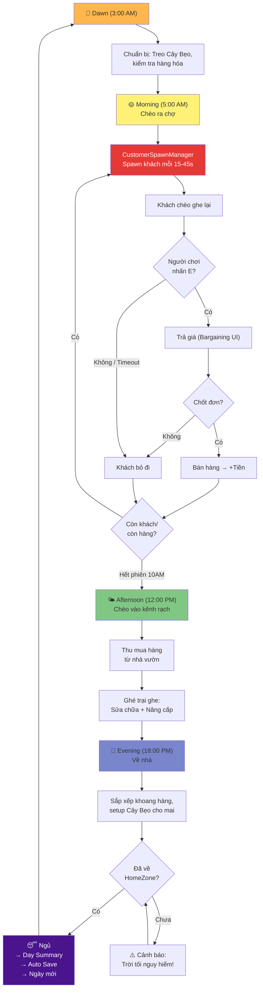

# Phân Tích Lỗ Hổng Gameplay — Chợ Nổi Miền Tây (MVP)

Sau khi phân tích toàn bộ codebase (~40 scripts), đối chiếu với [gameplay.txt](file:///e:/university/pru/new/cho-noi/gameplay.txt), dưới đây là các lỗ hổng khiến các tính năng riêng lẻ chưa kết nối thành một game hoàn chỉnh.

---

## Tổng Quan Tình Trạng Hiện Tại

```mermaid
graph TD
    subgraph "✅ ĐÃ CÓ (hoạt động riêng lẻ)"
        A["Hệ thống Kinh tế<br/>(Inventory, Wallet, Transaction)"]
        B["Mua bán với NPC<br/>(Trade UI, Bargaining UI)"]
        C["Nâng cấp Ghe<br/>(5 loại upgrade)"]
        D["Di chuyển Ghe<br/>(Physics, Fuel, Durability)"]
        E["Cây Bẹo Marketing<br/>(Treo hàng, attract NPC)"]
        F["Đồng hồ In-game<br/>(TimeManager, DayPhase)"]
        G["Game State Machine<br/>(FreeRoam, Trading, etc.)"]
        H["NPC tiếp cận người chơi<br/>(NpcCustomerBehavior)"]
        I["Hệ thống Save/Load"]
        J["Navigation Zones"]
    end

    subgraph "🔴 CHƯA CÓ (thiếu kết nối)"
        K["Orchestrator điều phối<br/>theo thời gian"]
        L["Khách hàng spawn<br/>liên tục theo phiên"]
        M["Quy trình ngày hoàn chỉnh<br/>(sáng→chiều→tối)"]
        N["Zone → UI tự động"]
        O["Nghỉ ngơi / Ngủ"]
        P["Tiêu thụ vật liệu<br/>khi sửa chữa / đổ xăng"]
    end

    F -.->|"OnPhaseChanged<br/>(0 subscriber)"| K
    G -.->|"OnStateChanged<br/>(0 subscriber)"| K
    J -.->|"OnZoneChanged<br/>(0 subscriber)"| N

    style K fill:#ff4444,color:#fff
    style L fill:#ff4444,color:#fff
    style M fill:#ff4444,color:#fff
    style N fill:#ff4444,color:#fff
    style O fill:#ff4444,color:#fff
    style P fill:#ff4444,color:#fff
```



---

## 🔴 Lỗ Hổng #1: Không Có Khách Hàng Đến Mua Liên Tục (CRITICAL)

> [!CAUTION]
> Đây là lỗ hổng lớn nhất. Hiện tại NPC được đặt sẵn trong scene. Một khi tất cả NPC đã trade xong (`HasTraded = true`), không bao giờ có khách mới nữa.

### Hiện trạng
- [NpcCustomerBehavior.cs](file:///e:/university/pru/new/cho-noi/Assets/_Project/Scripts/Presentation/NPC/NpcCustomerBehavior.cs) — NPC **tiếp cận** người chơi khi gần ✅
- [NpcTradeCoordinator.cs](file:///e:/university/pru/new/cho-noi/Assets/_Project/Scripts/Presentation/NPC/NpcTradeCoordinator.cs) — Chỉ 1 NPC tiếp cận tại 1 thời điểm ✅
- `RiverMarketConfig` có sẵn: `customerSpawnIntervalRange` (15-45s), `maxCustomersPerSession` (10) ✅

### Thiếu
- **CustomerSpawner** — Hệ thống spawn khách hàng mới liên tục trong suốt phiên bán hàng (Phase 1: sáng)
- Cơ chế: Mỗi 15-45 giây (theo config), spawn 1 NPC khách → NPC chèo ghe lại gần → chờ người chơi tương tác → mua hàng hoặc bỏ đi (hết patience) → NPC biến mất → spawn NPC mới
- Quãng nghỉ tự nhiên giữa các khách (random interval) để không bị spam
- Khi `BambooPoleManager.DisplayedItems.Count > 0`, tăng tần suất spawn (attract multiplier)
- Khi hết hàng trên ghe hoặc hết phiên → dừng spawn

### Đề xuất
Tạo script **`CustomerSpawnManager.cs`** trong `Scripts/Systems/`:
- Subscribe vào `TimeManager.OnPhaseChanged`
- Khi phase = `Morning` → bắt đầu coroutine spawn khách
- Khi phase != `Morning` → dừng spawn, dismiss tất cả khách
- Spawn NPC từ pool (Object Pooling) tại vị trí ngẫu nhiên ngoài tầm nhìn, cho chèo vào
- Mỗi NPC spawn có `desiredItems` ngẫu nhiên dựa trên items có trên Cây Bẹo
- Sau khi trade xong hoặc hết patience → NPC chèo đi và được recycle

---

## 🔴 Lỗ Hổng #2: Không Có "Nhạc Trưởng" Điều Phối Gameplay Theo Thời Gian (CRITICAL)

> [!CAUTION]
> TimeManager fire `OnPhaseChanged` nhưng **không có script nào subscribe**. GameStateManager fire `OnStateChanged` nhưng cũng **0 subscriber**. NavigationManager fire `OnZoneChanged` cũng **0 subscriber**. Các hệ thống hoạt động hoàn toàn độc lập.

### Hiện trạng
- [TimeManager.cs](file:///e:/university/pru/new/cho-noi/Assets/_Project/Scripts/Systems/TimeManager.cs) — Đồng hồ chạy, fire events ✅
- [GameStateManager.cs](file:///e:/university/pru/new/cho-noi/Assets/_Project/Scripts/Systems/GameStateManager.cs) — State machine hoạt động ✅
- Nhưng **không ai lắng nghe** các events này

### Thiếu
Một **GameplayOrchestrator** (hoặc **DayFlowController**) kết nối TimeManager + GameStateManager + NavigationManager:

| Thời gian | Phase | Gameplay tự động cần xảy ra |
|-----------|-------|-----------------------------|
| 3:00-5:00 AM | Dawn | Thức dậy, HUD hiện "Ngày X bắt đầu". Người chơi tự do chuẩn bị |
| 5:00-10:00 AM | Morning | **Auto-start phiên bán hàng**: Spawn khách liên tục, cho phép trade. NPC nào gần sẽ lại mua |
| 10:00-12:00 | (Break) | Tạm nghỉ — thông báo "Chợ tan" |
| 12:00-18:00 PM | Afternoon | **Khu vực sửa chữa/thu mua mở**: Cho phép đi kênh rạch, nâng cấp ghe |
| 18:00-20:00 PM | Evening | **Thông báo về nhà**: Hiện Cây Bẹo setup cho ngày mai. Dọn khoang hàng |
| 20:00-3:00 AM | Night | **Buộc về nhà**: Nếu ở HomeZone → cho phép Ngủ. Nếu không → cảnh báo → giảm stamina |

### Đề xuất
Tạo script **`DayFlowController.cs`** trong `Scripts/Systems/`:
```
OnPhaseChanged(Dawn)    → Show day start notification, GameState = FreeRoam
OnPhaseChanged(Morning) → Start CustomerSpawnManager, enable trading zones
OnPhaseChanged(Afternoon) → Stop customer spawn, enable repair/purchase zones  
OnPhaseChanged(Evening) → Show "prepare for tomorrow" prompt, open Cây Bẹo setup
OnPhaseChanged(Night)   → If in HomeZone: offer Sleep. Else: warning notification
```

---

## 🔴 Lỗ Hổng #3: Không Có Cơ Chế Ngủ / Kết Thúc Ngày (CRITICAL)

> [!IMPORTANT]
> Không có cách nào để người chơi kết thúc 1 ngày và chuyển sang ngày mới.

### Hiện trạng
- `TimeManager.AdvanceToNextDay()` tồn tại nhưng **không được gọi từ gameplay nào** 
- `FullSimulatorUI.ShowDayEndSummary()` tồn tại nhưng **không được gọi tự động**
- `SaveManager.SaveGame()` tồn tại nhưng **không được gọi khi ngủ**

### Thiếu
- **SleepInteraction**: Khi người chơi ở HomeZone vào buổi tối/đêm → hiện nút "Ngủ"
- Khi ngủ:
  1. Hiện `DayEndSummary` (tổng doanh thu, hàng đã bán, chi phí sửa chữa)
  2. Auto-save game
  3. `TimeManager.AdvanceToNextDay()` → chuyển sang ngày mới
  4. Reset `HasTraded` trên tất cả NPC
  5. Có thể có random events cho ngày mới (tin đồn thị trường từ `MarketNewsDatabase`)

### Đề xuất
Thêm logic vào **`DayFlowController.cs`**:
- Khi `OnZoneChanged(HomeZone)` + phase = Evening/Night → hiện UI "Ngủ"
- Nút Ngủ → gọi sequence: Summary → Save → AdvanceToNextDay → Fade transition

---

## 🟡 Lỗ Hổng #4: Zone Không Trigger Hành Động Nào

### Hiện trạng
- [NavigationManager.cs](file:///e:/university/pru/new/cho-noi/Assets/_Project/Scripts/Systems/NavigationManager.cs) — Detect zone entry/exit ✅
- Các zone types tồn tại: `MarketZone`, `RepairZone`, `HomeZone`, `DockingArea`, `Canal`, `OpenWater`

### Thiếu
| Zone | Hành động khi vào | Hiện tại |
|------|-------------------|----------|
| MarketZone | Cho phép trading, spawn khách | ❌ Không có gì |
| RepairZone | Mở UI sửa chữa/nâng cấp | ❌ Không tự động |
| HomeZone | Cho phép ngủ (tối) | ❌ Không có gì |
| Canal | Ghe chậm lại, nguy hiểm | ❌ Không có gì |
| DockingArea | Cho phép neo ghe | ❌ Không có gì |

### Đề xuất
Subscribe `DayFlowController` vào `NavigationManager.OnZoneChanged` để trigger UI/gameplay tương ứng.

---

## 🟡 Lỗ Hổng #5: Sửa Chữa / Đổ Xăng Không Tiêu Vật Liệu

### Hiện trạng
- Items tồn tại: Gỗ (Go), Nhựa Đường (NhuaDuong), Sơn Ghe (SonGhe), Xăng Dầu (XangDau)
- `FuelService.Refuel()` tồn tại nhưng **không kết nối với inventory**
- `BoatStats.Repair()` tồn tại nhưng **không tiêu thụ vật liệu từ inventory**

### Thiếu
- Khi sửa ghe: Tiêu thụ Gỗ + Nhựa Đường từ inventory → tăng Durability
- Khi đổ xăng: Tiêu thụ Xăng Dầu từ inventory → tăng Fuel
- Khi sơn ghe: Tiêu thụ Sơn Ghe → giảm tốc độ hao mòn durability

### Đề xuất
Tạo **`RepairService.cs`** trong `Scripts/Application/`:
- `RepairBoat(Inventory, BoatStats)` — Kiểm tra inventory có đủ vật liệu → trừ items → tăng durability
- `RefuelBoat(Inventory, FuelService)` — Kiểm tra inventory có XangDau → trừ item → refuel
- Kết nối vào Upgrade/Yard UI hiện tại

---

## 🟡 Lỗ Hổng #6: NPC Đã Trade Xong Không Reset

### Hiện trạng
- [NpcTradeTarget.cs](file:///e:/university/pru/new/cho-noi/Assets/_Project/Scripts/Presentation/NPC/NpcTradeTarget.cs) — `HasTraded` flag, `MarkAsTraded()` method
- Một khi NPC `HasTraded = true`, NPC **vĩnh viễn** không trade nữa (cho đến khi reload scene)

### Thiếu
- Reset `HasTraded` khi bắt đầu ngày mới (hoặc phiên mới)
- Hoặc: Nếu dùng hệ thống spawn (Lỗ Hổng #1), NPC cũ bị destroy → NPC mới spawn → không cần reset

### Đề xuất
Trong `DayFlowController.OnDayChanged()`:
```csharp
foreach (var npc in FindObjectsByType<NpcTradeTarget>())
    npc.ResetTradeState(); // thêm method này
```

---

## 🟡 Lỗ Hổng #7: Cây Bẹo Chưa Ảnh Hưởng Đến Giá Bán / Loại Khách

### Hiện trạng
- [BambooPoleManager.cs](file:///e:/university/pru/new/cho-noi/Assets/_Project/Scripts/Presentation/Marketing/BambooPoleManager.cs) — Treo hàng lên sào ✅
- `GetAttractMultiplier()` trả về giá trị nhưng **không ai dùng**
- `NpcCustomerBehavior` chỉ check `DisplayedItems.Count > 0` (có/không), **không quan tâm loại hàng**

### Theo gameplay.txt
> "Treo khóm gọi lái sỉ khóm, treo quần áo gọi khách vãng lai"

### Thiếu
- Hàng treo trên Cây Bẹo phải **ảnh hưởng loại khách đến** (sỉ/lẻ, mua hàng tương ứng)
- Attract multiplier nên **tăng tần suất spawn** khách (dùng trong CustomerSpawnManager)
- Có thể: mỗi item trên Cây Bẹo tăng xác suất spawn khách muốn mua loại item đó

### Đề xuất
Kết nối `BambooPoleManager.DisplayedItems` vào `CustomerSpawnManager`:
- Khách spawn sẽ ưu tiên muốn mua loại hàng đang treo trên Cây Bẹo
- `GetAttractMultiplier()` → giảm `spawnInterval` (spawn nhanh hơn)

---

## 🟡 Lỗ Hổng #8: SaveManager Thiếu Dữ Liệu

### Hiện tại lưu
✅ Wallet balance, ✅ Inventory, ✅ Boat stats, ✅ Upgrade levels, ✅ Time (hour/minute/day)

### Chưa lưu
- ❌ `GameState` hiện tại (FreeRoam/Trading/etc.)
- ❌ Cây Bẹo configuration (items đang treo)
- ❌ Trạng thái NPC (ai đã trade)
- ❌ Thống kê session (tổng doanh thu ngày)

### Đề xuất
Bổ sung vào [SaveManager.cs](file:///e:/university/pru/new/cho-noi/Assets/_Project/Scripts/Systems/SaveManager.cs):
- Save/Load Cây Bẹo displayed items
- Save/Load daily statistics

---

## 🟢 Lỗ Hổng Nhỏ / Polish

### #9: Không có thông báo/tutorial hướng dẫn người chơi
- Người chơi mới không biết phải làm gì
- Cần: Notification system hiện hướng dẫn theo phase ("Trời sáng rồi! Hãy chèo ghe ra chợ bán hàng")
- `FullSimulatorUI` có `IsTutorialOpen` nhưng không có nội dung tutorial thực sự

### #10: Tin đồn thị trường chưa ảnh hưởng gameplay
- `MarketNewsDatabase` tồn tại với 3 ngày tin tức
- Nhưng tin đồn **không ảnh hưởng** giá cả ngày hôm sau
- Cần: Kết nối `MarketNewsDatabase` vào `PriceCalculator` để tin đồn → thay đổi demand/supply ngày sau

### #11: Stamina System chưa hoàn thiện
- Gameplay.txt đề cập "Stamina" cho bargaining
- `BargainingConfig.staminaCostPerRound = 5` tồn tại
- Nhưng **không có Stamina bar trên HUD**, không có cách hồi phục stamina (ngoài mua bún/cà phê)
- MVP có thể bỏ qua nếu cần

### #12: Thủy triều / Thời tiết chưa ảnh hưởng gameplay
- `EnvironmentProfile` có `waterLevel`, `fogDensity` — ảnh hưởng visual
- Nhưng **không ảnh hưởng gameplay** (kênh cạn → mắc cạn → hỏng ghe)
- MVP có thể bỏ qua

---

## Tóm Tắt Ưu Tiên Triển Khai MVP

| # | Lỗ hổng | Mức độ | Script cần tạo/sửa |
|---|---------|--------|---------------------|
| 1 | Customer Spawn liên tục | 🔴 CRITICAL | **[NEW]** `CustomerSpawnManager.cs` |
| 2 | Orchestrator thời gian→gameplay | 🔴 CRITICAL | **[NEW]** `DayFlowController.cs` |
| 3 | Ngủ / Kết thúc ngày | 🔴 CRITICAL | Thêm vào `DayFlowController.cs` + sửa UI |
| 4 | Zone → trigger gameplay | 🟡 IMPORTANT | Thêm vào `DayFlowController.cs` |
| 5 | Sửa chữa tiêu vật liệu | 🟡 IMPORTANT | **[NEW]** `RepairService.cs` |
| 6 | Reset NPC mỗi ngày | 🟡 IMPORTANT | Sửa `NpcTradeTarget.cs` + `DayFlowController.cs` |
| 7 | Cây Bẹo → loại khách | 🟡 IMPORTANT | Sửa `CustomerSpawnManager.cs` + `BambooPoleManager.cs` |
| 8 | Save thêm dữ liệu | 🟡 IMPORTANT | Sửa `SaveManager.cs` |
| 9 | Tutorial / Notification | 🟢 POLISH | Sửa `FullSimulatorUI.cs` |
| 10 | Tin đồn → giá cả | 🟢 POLISH | Sửa `PriceCalculator.cs` |

---

## Sơ Đồ Luồng Game Hoàn Chỉnh (Sau Khi Fix)



---

## Open Questions

> [!IMPORTANT]
> 1. **Spawn từ đâu?** Khách hàng spawn tại vị trí nào? Có spawn point cố định trên map không, hay random từ ngoài camera? (Do map do người khác làm, cần thống nhất convention đặt spawn point)

> [!IMPORTANT]
> 2. **NPC Pool hay Instantiate?** Dùng Object Pooling (tốt cho performance) hay Instantiate/Destroy đơn giản (dễ implement)? Cho MVP, Instantiate/Destroy có lẽ đủ.

> [!IMPORTANT]
> 3. **Ép buộc hay gợi ý?** Khi hết giờ buổi sáng, có ép người chơi rời chợ không, hay chỉ hiện thông báo "Chợ đã tan"? Tương tự, ban đêm có ép về nhà hay chỉ cảnh báo?

> [!IMPORTANT]
> 4. **Phạm vi MVP cho Cây Bẹo?** Cây Bẹo ảnh hưởng loại khách (như gameplay.txt) hay chỉ ảnh hưởng tần suất spawn? Implement đầy đủ sẽ phức tạp hơn.

> [!IMPORTANT]
> 5. **Repair/Refuel flow?** Sửa chữa tự động trừ vật liệu khi nhấn nút, hay hiện UI cho người chơi chọn bao nhiêu Gỗ/Nhựa Đường dùng?

---

## Verification Plan

### Automated Tests
- Unit test cho `CustomerSpawnManager`: spawn interval, max customers, pool lifecycle
- Unit test cho `DayFlowController`: phase transitions trigger correct actions
- Unit test cho `RepairService`: material consumption + stat recovery

### Manual Verification
- Chạy Full UI Simulator scene
- Verify: Sáng → khách tự động lại mua → chiều → sửa ghe → tối → ngủ → ngày mới
- Verify: Cây Bẹo ảnh hưởng khách đến
- Verify: Hết hàng → hết khách spawn
- Verify: Save/Load giữ đúng trạng thái


## Design Decisions (Resolved)

### 1. Spawn Position
- Người chơi spawn ở khu vực nhà và phải đi ra cầu để xuống ghe.
- Khách spawn từ các Spawn Point ngoài tầm nhìn rồi chèo vào.

### 2. NPC Spawn Strategy
- Có thể dùng Object Pool hoặc Instantiate.
- Spawn nhiều loại NPC: khách mua hàng, thương lái, khách du lịch, người bán vật liệu, nhiên liệu, đồ ăn...

### 3. Phase Transition
- Không ép cứng người chơi.
- Gameplay thay đổi theo thời gian: NPC giảm, dịch vụ đóng, thông báo xuất hiện để người chơi tự chuyển phase như Dave the Diver.

### 4. Bamboo Pole
- Cây Bẹo quyết định NPC nào có thể spawn.
- NPC chỉ mua các mặt hàng phù hợp với món đang treo.

### 5. Repair Flow
- Repair/Refuel chỉ cần nhấn nút, trừ tiền và cập nhật chỉ số.
